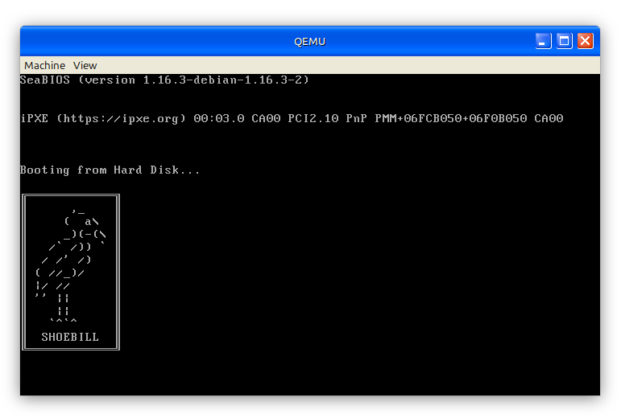

# Simple_Bootloader
In this repository i learn how to write my own bootloader based from book ["Writing Operating System From Scratch"](book/Writing%20a%20Simple%20Operating%20System%20from%20Scratch%20-%20Nick%20Blundell%20-%20Dec%202010.pdf) by Nick Blundell


## Reference
1. ["Writing Operating System From Scratch"](book/Writing%20a%20Simple%20Operating%20System%20from%20Scratch%20-%20Nick%20Blundell%20-%20Dec%202010.pdf) by Nick Blundell
2. ["The C Programming Language - 2nd Edition"](book/C%20Programming%20Language%20-%202nd%20Edition.pdf) by Brian Kernighan and Dennis Ritchie

## Preview
Bootloader Preview:


## Things you need before run
1. NASM (Netwide Assembler)

    install instruction for on Debian, Ubuntu, or any derivative distribution like Linux Mint or Pop!_OS

    ```
    sudo apt update
    sudo apt install nasm -y
    nasm --version
    ```

2. QEMU Virtual Machine

    install instruction : https://www.qemu.org/download/


## How to run

```
nasm boot_sect.asm -f bin -o binary_file/boot_sect.bin
```
```
qemu-system-x86_64 -drive format=raw,file=binary_file/boot_sect.bin
```

